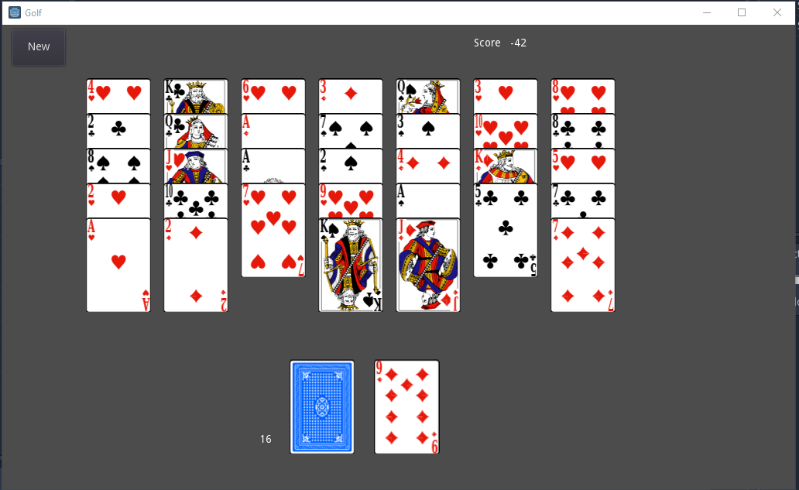

# Golf---Godot
Golf Card Game in Godot

This is a simple "Golf" Card Game written in Godot engine.

The card faces are from SVG Cards (https://www.npmjs.com/package/svg-cards), originally created by David Bellot.

## How to Play
Click a card that is one higher or lower than the face-up foundation card. Win by playing all the Tablea Cards.

 * Ace matches King or 2
 * Game is over when the tableau or stock is empty

## Parts of the Screen
### New
Starts a new game

### Tableau
Try to remove all of these cards by matching one higher or lower than the foundation card

### Stock
Click this to get a new foundation card

### Foundation
This is the card that you are trying to match one higher or lower.

## To Do

### Essential
* Leave cards on screen all the time, don't replace with stock and foundation
* Add Undo capability

### Nice to have
* Set background color to dark green (add ColorRect to playfield)
* Animate cards from stock to tableau on start
* Add card flip sound
* Move counter
* Timer
* Find out about game# (specific randomization)
